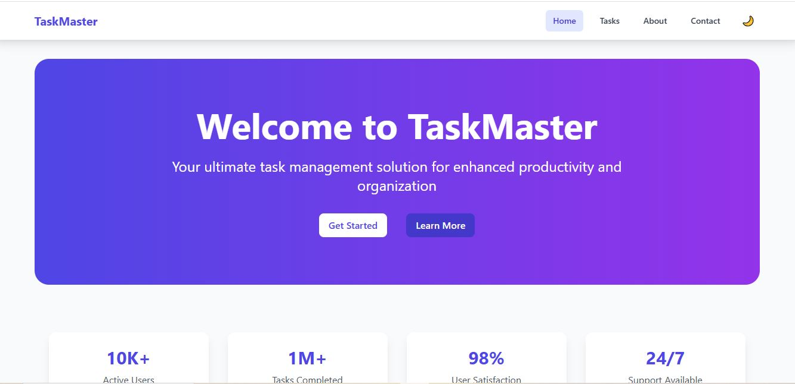
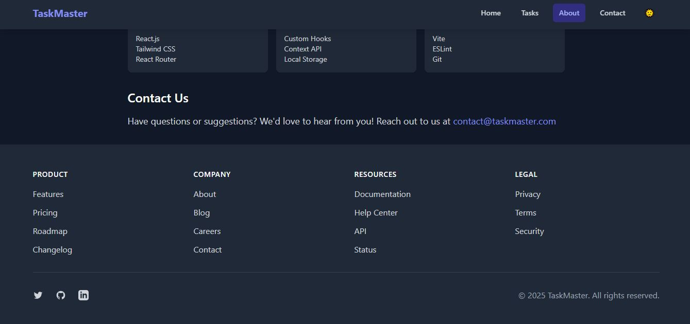
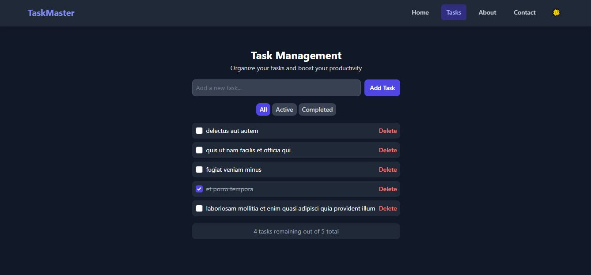

# Deployed app link
https://week-3-react-js-assignment-muthee-e.vercel.app/

---

## 🛠️ Setup Instructions

1. **Prerequisites:**  
   - Node.js v18 or higher  
   - pnpm (recommended) or npm

2. **Clone the repository:**  
   ```sh
   git clone https://github.com/PLP-MERN-Stack-Development/week-3-react-js-assignment-mutheeEverlyn.git
   cd week-3-react-js-assignment-mutheeEverlyn
   ```

3. **Install dependencies:**  
   ```sh
   pnpm install
   # or
   npm install
   ```

4. **Start the development server:**  
   ```sh
   pnpm dev
   # or
   npm run dev
   ```

5. **Build for production:**  
   ```sh
   pnpm build
   # or
   npm run build
   ```

6. **Preview the production build:**  
   ```sh
   pnpm preview
   # or
   npm run preview
   ```

---

## 🖼️ Screenshots




---

## 📑 Assignment Overview

- Built with **React.js**, **Vite**, and **Tailwind CSS**
- Features:
  - Reusable components (Button, Card, Navbar, Footer, etc.)
  - Task management with add, complete, delete, and filter
  - API integration and data fetching
  - Responsive design and theme switcher (light/dark)
  - Custom hooks and context for state management

---
